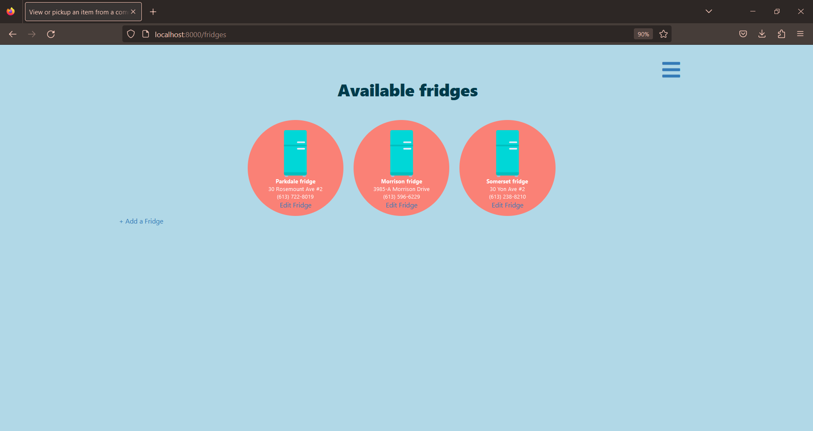
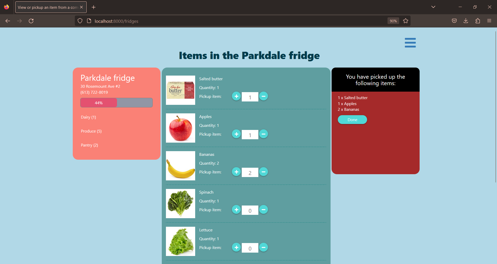

# Community Fridge

This repository contains the code of a web application for a community fridge which allows users to view and drop off items.





## Launching

```bash
node server.js
```

## Testing

http://localhost:8000
